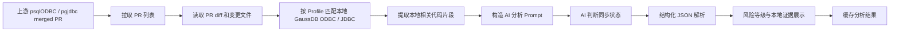

# AI 辅助 GaussDB 驱动质量排查实践：上游 PR 智能追踪与本地风险分析工具

> 文档定位：用于公司内部 Wiki、AI 辅助编程优秀实践案例沉淀、团队汇报材料补充。  
> 项目名称：GaussDB Driver PR Tracker  
> 适用范围：GaussDB 驱动方向，当前落地覆盖 ODBC / JDBC 两类与 PostgreSQL 生态高度相关的客户端驱动代码。
> 截图说明：本文已预留截图占位，实际页面截图由维护人补充到对应位置。

---

## 目录架构

1. [背景与痛点](#1-背景与痛点)
2. [业务价值与实践意义](#2-业务价值与实践意义)
3. [问题挑战](#3-问题挑战)
4. [建设目标](#4-建设目标)
5. [方案总览](#5-方案总览)
6. [核心工作流设计](#6-核心工作流设计)
7. [系统架构设计](#7-系统架构设计)
8. [AI 分析能力设计](#8-ai-分析能力设计)
9. [工程落地实现](#9-工程落地实现)
10. [安全与合规设计](#10-安全与合规设计)
11. [典型使用场景](#11-典型使用场景)
12. [演示流程与截图占位](#12-演示流程与截图占位)
13. [效果评估与收益](#13-效果评估与收益)
14. [实践复盘](#14-实践复盘)
15. [推广计划](#15-推广计划)
16. [风险、边界与后续演进](#16-风险边界与后续演进)
17. [附录：本地部署与配置](#17-附录本地部署与配置)

---

## 1. 背景与痛点

GaussDB 数据库驱动长期需要面向多种生态协议和客户端接口进行维护，例如 ODBC、JDBC 等。由于 GaussDB 驱动与 PostgreSQL 开源生态存在较高相似度，上游社区已经合入的缺陷修复 PR 往往对 GaussDB 驱动具备重要参考价值。

在质量排查阶段，团队需要持续关注上游 `psqlodbc`、`pgjdbc` 等项目的修复动态，并判断本地 GaussDB 驱动是否存在相同或相似问题。传统处理方式主要依赖人工：

- 人工浏览 GitHub 上游 PR。
- 人工判断 PR 是否属于缺陷修复。
- 人工查看 patch diff。
- 人工在本地 GaussDB 仓库中搜索相似文件和函数。
- 人工对比上游修复前后的逻辑差异。
- 人工输出是否需要同步修复的判断。

这种方式可行，但存在明显效率瓶颈：

| 痛点 | 说明 |
| --- | --- |
| 信息发现成本高 | 上游 PR 数量多，人工筛选容易遗漏。 |
| 相似代码判断成本高 | GaussDB 代码经过长期演进，文件名和函数逻辑可能相似但不完全一致。 |
| 质量排查不易规模化 | 单个 PR 可以人工分析，但批量历史 PR 排查耗时明显。 |
| 结论沉淀不足 | 人工分析结果容易散落在个人笔记、会议纪要或临时文档中。 |
| 复核链路不清晰 | 判断“已修复 / 需同步 / 不相关”时缺少统一证据格式。 |

因此，本项目尝试用 AI 辅助方式将“上游 PR 发现、本地代码匹配、风险分析、结论沉淀”串成一个可复用、可展示、可推广的质量排查工作流。

---

## 2. 业务价值与实践意义

本项目的核心价值不是单纯“调用 AI 总结 PR”，而是将 AI 嵌入数据库驱动质量排查流程，形成一个面向真实研发工作的工具化闭环。

### 2.1 对质量工作的价值

- 将上游社区修复转化为 GaussDB 驱动质量排查线索。
- 发现潜在历史缺陷、兼容性问题、内存安全问题和边界处理问题。
- 支持对已合入修复进行确认，避免重复投入。
- 为后续补丁同步、代码评审、测试设计提供证据基础。

### 2.2 对效率提升的价值

- 将人工查找上游 PR、阅读 diff、定位本地文件的流程自动化。
- 将“是否需要同步修复”的初步判断从人工经验驱动转为 AI 辅助证据驱动。
- 支持批量 PR 分析，适合阶段性质量专项排查。
- 输出结构化结论，便于复盘和二次审查。

### 2.3 对 AI 辅助编程实践的价值

该项目体现了 AI 辅助编程从“聊天问答”走向“工程化工具”的实践路径：

- 有明确业务痛点。
- 有真实代码仓输入。
- 有可视化工作流。
- 有本地配置、安全边界和缓存机制。
- 有结构化输出和人工复核入口。
- 可以持续扩展到更多驱动、更多上游仓库和更多质量任务。

---

## 3. 问题挑战

### 3.1 上游与本地代码并非完全一致

GaussDB 驱动与上游 PostgreSQL 驱动高度相似，但并不总是一比一同步：

- 文件结构可能调整。
- 函数实现可能经过改造。
- 修复可能已经提前合入。
- 部分上游逻辑在 GaussDB 中不存在。
- 同一问题可能以不同代码形式存在。

因此，工具不能简单依据“文件名匹配”就判断存在风险，必须进一步分析本地代码是否已经具备等价修复。

### 3.2 AI 输出需要可复核

质量排查场景不能只接受“看起来合理”的自然语言结论。结论必须具备可复核证据：

- 本地文件路径。
- 函数名。
- 变量名。
- 行号附近代码。
- 上游新增或删除逻辑与本地逻辑的对应关系。

这要求 AI 输出必须结构化，并且具备证据字段，而不是只生成问题摘要。

### 3.3 内网环境模型接入复杂

实际公司内网环境可能使用 Anthropic 兼容网关、MiniMax、Qwen 或 LiteLLM 代理。模型可能输出 `<think>` 推理过程，也可能因为模型组健康状态异常导致请求失败。

工具需要兼容：

- Anthropic 兼容接口。
- MiniMax 原生接口。
- ClaudeCode 已有配置迁移。
- GitHub Token 配置。
- 端口占用自动切换。
- AI JSON 输出不稳定的修复链路。

### 3.4 敏感信息不能泄露

工具会接触：

- API Key。
- GitHub Token。
- 本地公司仓库路径。
- AI 分析缓存。
- 内部代码风险判断结果。

因此必须从一开始设计 `.gitignore`、脱敏展示和本地存储边界，避免将敏感配置提交到 GitHub。

---

## 4. 建设目标

### 4.1 核心目标

构建一个面向 GaussDB 驱动质量排查的 AI 辅助工具，实现：

1. 自动拉取上游 `psqlodbc` / `pgjdbc` 已合入 PR。
2. 按驱动 Profile 自动匹配本地 GaussDB ODBC / JDBC 仓库中的对应文件。
3. 自动构造上游 diff 与本地代码上下文。
4. 使用 AI 判断本地是否存在相同或相似问题。
5. 区分本地状态：已修复、需要同步、本地无对应代码、证据不足。
6. 将分析结果以可视化方式展示并缓存。

### 4.2 输出目标

每个 PR 的分析结果应包含：

| 字段 | 说明 |
| --- | --- |
| 问题摘要 | 上游 PR 修复的问题。 |
| 同步状态 | 已修复 / 需要同步 / 本地无对应代码 / 证据不足。 |
| 风险等级 | HIGH / MEDIUM / LOW / NOT_APPLICABLE / UNKNOWN。 |
| 风险依据 | 基于本地代码的具体判断。 |
| 本地证据 | 文件、函数、行号、变量或关键逻辑。 |
| 影响文件 | 本地命中的 GaussDB 文件。 |
| 修复建议 | 若已修复则说明无需修改；若未修复则给出同步建议。 |

### 4.3 汇报目标

从团队实践角度，该项目需要满足：

- 能演示完整工作流。
- 能体现 AI 提效价值。
- 能体现工程落地质量。
- 能作为驱动质量排查工具持续使用。
- 能沉淀为可推广的实践模板。

---

## 5. 方案总览

本工具采用轻量级 Web 应用方式实现：

- 后端：Node.js + Express。
- 前端：单页 HTML + Tailwind CSS。
- 数据源：GitHub 上游驱动 merged PR。
- 本地代码源：GaussDB ODBC / JDBC 本地仓库。
- AI 接口：Anthropic 兼容接口 / MiniMax Chat Completions。
- 缓存：本地 `data/` 目录。

整体流程如下：



核心设计原则：

- AI 不直接替代工程判断，而是输出可复核证据。
- 不只判断“有没有风险”，还判断“本地是否已经修复”。
- 不将内部密钥、缓存、分析结果提交到仓库。
- 工具优先服务真实质量排查流程，而不是做展示型 Demo。

---

## 6. 核心工作流设计

### 6.1 首次配置

用户启动工具后，需要配置：

- 驱动 Profile：ODBC 或 JDBC。
- 当前 Profile 对应的本地 GaussDB 驱动仓库路径。
- AI 接口类型和模型。
- GitHub Token。
- 可选 HTTP 代理。

工具支持从 ClaudeCode 自动导入 AI 配置，减少内网迁移成本。

> 截图占位：首次配置页面  
> 建议文件：`docs/images/01-setup-page.png`

### 6.2 PR 列表获取

工具按驱动 Profile 从 GitHub API 拉取对应上游仓库中 closed 且已 merge 的 PR，并在页面展示。当前支持的 Profile 包括 ODBC 和 JDBC：

| Profile | 上游来源 | 本地代码路径 |
| --- | --- | --- |
| ODBC | `postgresql-interfaces/psqlodbc` | GaussDB ODBC 仓库 |
| JDBC | `pgjdbc/pgjdbc` | GaussDB JDBC 仓库 |

说明：libpq 暂不纳入当前 PR 追踪模型。`postgres/postgres` 在 GitHub 上不适合按 merged PR 工作流获取修复线索，后续如需覆盖 libpq，应单独建设 commit / mailing list 追踪链路。

页面主要展示：

- PR 编号。
- 标题。
- 合入时间。
- 变更文件数量。
- 当前分析状态。

> 截图占位：PR 列表首页  
> 建议文件：`docs/images/02-pr-list.png`

### 6.3 单个 PR 分析

用户点击“分析”后，系统执行：

1. 拉取该 PR 的详细信息。
2. 拉取该 PR 的 changed files 和 patch。
3. 按 Profile 过滤驱动核心代码文件，例如 ODBC 的 `.c/.h`、JDBC 的 `.java/.xml/.properties`。
4. 按上游文件名在本地 GaussDB 驱动仓库中匹配。
5. 提取上游新增 / 删除逻辑线索。
6. 提取本地相关函数和代码片段。
7. 调用 AI 生成结构化分析。
8. 展示同步状态、风险等级、本地证据和建议。

> 截图占位：点击分析后的详情页  
> 建议文件：`docs/images/03-analysis-detail.png`

### 6.4 批量分析

工具支持批量分析未分析 PR，适合阶段性质量专项：

- 可勾选若干目标 PR 后只分析选中项。
- 可全选当前筛选结果后批量分析。
- 批量扫描历史 merged PR。
- 自动生成风险台账。
- 高风险项优先复核。

> 截图占位：批量分析过程  
> 建议文件：`docs/images/04-batch-analysis.png`

---

## 7. 系统架构设计

### 7.1 模块划分

```text
gaussdb-pr-tracker
├── server.js               后端服务入口
├── public/index.html       前端单页应用
├── data/                   本地缓存和配置，不提交仓库
├── .env.example            环境变量模板
├── README.md               使用说明
└── docs/                   Wiki 和实践文档
```

### 7.2 后端模块

| 模块 | 职责 |
| --- | --- |
| Settings | 读取 `.env`、`data/settings.json` 和 ClaudeCode 配置。 |
| Driver Profiles | 管理 ODBC / JDBC 的上游仓库、本地路径、源码过滤规则和 Prompt 语境。 |
| GitHub Helper | 调用 GitHub API 获取 PR 列表、PR 详情和 diff 文件。 |
| Local Code Search | 在当前 Profile 的本地 GaussDB 驱动仓库中匹配上游文件。 |
| Patch Parser | 提取上游新增行、删除行、函数名和关键标识符。 |
| AI Layer | 统一 Anthropic 兼容接口和 MiniMax 原生接口。 |
| JSON Parser | 清洗 AI 输出，剥离 `<think>`，修复和解析 JSON。 |
| Result Cache | 按 Profile 缓存 PR 列表和分析结果，避免 ODBC / JDBC 结果混淆。 |

### 7.3 前端模块

| 模块 | 职责 |
| --- | --- |
| Setup Page | 首次配置本地路径、AI 和 GitHub Token。 |
| Profile Selector | 在 ODBC / JDBC 之间切换分析对象。 |
| Dashboard | 展示当前 Profile 的 PR 列表和统计卡片。 |
| Filter Tabs | 按风险等级和未分析状态筛选。 |
| Detail Panel | 展示单个 PR 的 AI 分析结论。 |
| Settings Modal | 修改配置、导入 ClaudeCode 配置。 |
| Toast | 展示操作提示和错误。 |

---

## 8. AI 分析能力设计

### 8.1 从“摘要生成”到“同步状态判断”

初始版本中，AI 容易只输出 PR 的问题摘要，或者看到本地文件后直接建议同步修复。实际质量排查需要更准确的问题：

> 本地 GaussDB 驱动代码是否已经合入了等价修复？

因此分析结果被设计为四类状态：

| 状态 | 说明 |
| --- | --- |
| `ALREADY_FIXED` | 本地代码已有等价修复，无需修改。 |
| `NEEDS_FIX` | 本地仍存在上游修复前问题，需要同步。 |
| `NOT_PRESENT` | 本地没有对应代码或该 PR 与驱动核心逻辑无关。 |
| `UNCLEAR` | 证据不足，需要人工进一步确认。 |

### 8.2 Prompt 输入内容

AI Prompt 中包含：

- PR 标题和描述。
- 上游 diff。
- 上游新增修复线索。
- 上游删除旧逻辑线索。
- 本地文件路径。
- 带行号的本地代码片段。
- 本地代码与上游新增 / 删除行的命中信号。

示例输入结构：

```text
上游文件：convert.c
社区修复 diff：...
上游新增修复线索：...
上游删除旧逻辑线索：...
本地代码命中信号：...
GaussDB 对应代码，左侧为本地行号：...
```

### 8.3 Prompt 输出结构

AI 必须输出严格 JSON：

```json
{
  "summary": "一句话说明上游 PR 修复的问题",
  "fixStatus": "ALREADY_FIXED",
  "bugType": "缓冲区溢出",
  "riskLevel": "NOT_APPLICABLE",
  "riskReason": "本地 convert.c 已包含等价边界检查，未发现上游修复前风险。",
  "evidence": [
    "本地证据1：convert.c 行号附近已经限制 precision。",
    "本地证据2：getPrecisionPart() 已包含对应 NUL 终止处理。"
  ],
  "affectedFiles": [
    "D:/openGauss-connector-odbc/convert.c"
  ],
  "recommendation": "无需修改：本地代码已经合入等价修复。",
  "hasCorrespondingCode": true
}
```

### 8.4 AI 输出鲁棒性处理

内网模型可能输出 `<think>` 推理过程、Markdown 代码块或非严格 JSON。为此后端增加了多层防护：

1. Prompt 中加入 `/no_think`。
2. 明确要求只输出 JSON。
3. 增大输出 token 上限，降低 JSON 被截断概率。
4. 自动剥离 `<think>...</think>`。
5. 自动剥离 Markdown 代码块。
6. 扫描平衡大括号提取 JSON。
7. 解析失败时二次调用模型进行 JSON 修复。
8. 对枚举字段进行后端兜底校验。

---

## 9. 工程落地实现

### 9.1 配置迁移

为了适配研发人员已有的 ClaudeCode 环境，工具支持扫描：

- `~/.claude/settings.json`
- `~/.claude.json`
- `%APPDATA%\Claude\settings.json`
- `%LOCALAPPDATA%\claude-cli-nodejs\settings.json`
- `~/.cc-switch/backups/env-backup-*.json`

导入时会展示候选配置来源、模型、Base URL 和脱敏 token，用户选择后写入本项目的 `data/settings.json`。

> 截图占位：ClaudeCode 配置导入候选列表  
> 建议文件：`docs/images/05-claudecode-import.png`

### 9.2 端口占用处理

研发环境中经常出现关闭浏览器但 Node 服务仍运行的情况。工具支持：

- 默认端口 `3000`。
- `3000` 被占用时自动尝试 `3001`、`3002` 等后续端口。
- 控制台打印实际访问地址。
- 支持 `.env` 固定 `PORT`。

### 9.3 结果缓存与版本控制

分析结果缓存到：

```text
data/analysis_<PR编号>.json
```

为避免旧 Prompt 的分析结果污染新逻辑，结果中包含 `analysisPromptVersion`。当分析逻辑升级后，旧缓存不会继续作为有效结果展示。

### 9.4 重新分析机制

用户点击“重新分析”时，前端会带上：

```text
?force=1
```

后端会绕过缓存，重新拉取 PR 信息并调用 AI 生成结果。

---

## 10. 安全与合规设计

### 10.1 敏感文件不提交

`.gitignore` 已忽略：

```text
node_modules/
.env
.env.*
data/settings.json
data/analysis_*.json
data/prs.json
```

这些文件可能包含：

- AI API Key。
- GitHub Token。
- 公司内部仓库路径。
- 内部分析结论。
- 缓存的风险判断。

### 10.2 Token 脱敏展示

页面和接口只展示脱敏 token，例如：

```text
sk-x...xxxx
```

不会在候选配置列表中返回完整密钥。

### 10.3 本地优先原则

工具只读取用户显式配置的本地仓库路径，不上传完整仓库。AI 输入只包含与上游 patch 匹配的局部片段，用于降低数据暴露面。

---

## 11. 典型使用场景

### 11.1 上游高危修复同步排查

当上游 psqlODBC 或 pgjdbc 合入内存安全、缓冲区边界、空指针、协议状态、数据绑定等修复时，工具可以快速判断对应 GaussDB 驱动是否存在同源风险。

### 11.2 历史 PR 批量回溯

质量专项期间，可以批量拉取历史 merged PR，生成高风险项列表，由人工进行复核和跟踪。

### 11.3 已修复状态确认

部分上游修复可能已经在 GaussDB 中提前合入。工具会输出 `ALREADY_FIXED`，并给出本地代码证据，避免重复开发。

### 11.4 测试补充线索生成

对于 `NEEDS_FIX` 或 `UNCLEAR` 项，工具输出的本地函数、变量和边界条件可以作为后续黑盒 / 回归测试设计输入。

---

## 12. 演示流程与截图占位

### 12.1 启动工具

```powershell
npm start
```

控制台输出访问地址：

```text
GaussDB PR Tracker -> http://localhost:3000
```

> 截图占位：启动命令与控制台输出  
> 建议文件：`docs/images/06-startup-console.png`

### 12.2 首次配置

配置内容：

- 驱动 Profile。
- 本地 GaussDB ODBC / JDBC 仓库路径。
- AI Provider。
- GitHub Token。
- 代理。

> 截图占位：首次配置页面  
> 建议文件：`docs/images/01-setup-page.png`

### 12.3 PR 列表浏览

查看上游 merged PR 列表，选择目标 PR。

> 截图占位：PR 列表  
> 建议文件：`docs/images/02-pr-list.png`

### 12.4 点击分析

AI 分析该 PR 是否影响当前 Profile 对应的本地 GaussDB 驱动代码。

> 截图占位：分析中状态  
> 建议文件：`docs/images/07-analyzing.png`

### 12.5 查看结构化结果

重点展示：

- 同步状态。
- 风险等级。
- 本地代码证据。
- 修复建议。

> 截图占位：已修复案例  
> 建议文件：`docs/images/08-already-fixed-case.png`

> 截图占位：需要同步案例  
> 建议文件：`docs/images/09-needs-fix-case.png`

### 12.6 批量分析

对未分析 PR 进行批量扫描，生成风险台账。

> 截图占位：批量分析结果  
> 建议文件：`docs/images/10-batch-result.png`

---

## 13. 效果评估与收益

> 以下指标建议结合实际使用数据补充。

### 13.1 效率收益

| 指标 | 传统方式 | 使用工具后 | 说明 |
| --- | --- | --- | --- |
| 单个 PR 初筛耗时 | 待补充 | 待补充 | 建议按 5 个典型 PR 取平均。 |
| 本地文件定位耗时 | 待补充 | 待补充 | 工具自动按文件名匹配。 |
| 批量历史 PR 初筛 | 待补充 | 待补充 | 可按 100 个 PR 统计。 |
| 结论整理耗时 | 待补充 | 待补充 | 输出已结构化。 |

### 13.2 质量收益

| 类型 | 收益 |
| --- | --- |
| 缺陷发现 | 将上游已验证修复转化为本地排查线索。 |
| 重复工作减少 | 已修复项可快速确认，无需重复修改。 |
| 复核效率提升 | 结论包含本地代码证据，便于评审。 |
| 测试补充 | AI 输出的边界条件可转化为测试点。 |

### 13.3 可视化收益

工具将原本分散在 GitHub、IDE、命令行、笔记中的工作流集中到一个页面，适合：

- 团队内部质量专项看板。
- AI 辅助编程实践展示。
- 向管理层说明 AI 在真实研发流程中的落地价值。

---

## 14. 实践复盘

### 14.1 成功点

- 找到了真实、高频、有价值的质量排查场景。
- 没有停留在聊天式问答，而是形成了完整工具。
- 支持本地代码仓输入，能结合实际 GaussDB ODBC / JDBC 代码分析。
- 支持 ClaudeCode 配置迁移，降低内网部署成本。
- 引入结构化 JSON 输出，便于缓存、展示和复核。
- 增加 AI 输出修复链路，提升内网模型稳定性。
- 引入驱动 Profile 机制，使 ODBC 与 JDBC 的上游来源、路径配置、缓存和 Prompt 语境互相隔离。

### 14.2 关键经验

1. AI 工具必须围绕真实研发流程设计。
2. 质量场景不能只要摘要，必须要证据。
3. 工具要考虑内网模型、代理、Token、端口等工程问题。
4. AI 输出不稳定是常态，必须设计解析、修复和兜底。
5. 缓存结果必须有版本号，避免旧逻辑污染新结论。

### 14.3 对团队的启发

该实践说明 AI 辅助编程可以从“个人编码助手”升级为“团队级质量工具”：

- 输入是团队真实资产：本地代码仓。
- 数据源是高价值外部信号：上游已合入 PR。
- 输出是团队可复用产物：风险台账和修复建议。
- 工作流可以持续运行，而不是一次性 Prompt。

---

## 15. 推广计划

### 15.1 横向推广到驱动质量排查

| 驱动 | 当前状态 |
| --- | --- |
| ODBC | 已支持，持续跟踪 `postgresql-interfaces/psqlodbc`。 |
| JDBC | 已支持，持续跟踪 `pgjdbc/pgjdbc`。 |
| libpq | 暂不纳入 PR 模型；PostgreSQL 官方 GitHub 仓库不适合按 merged PR 追踪，后续应单独设计 commit / mailing list 方案。 |

### 15.2 扩展数据源

后续可接入：

- GitHub PR。
- Git commit。
- Release note。
- CVE 公告。
- 内部缺陷库。
- 静态扫描告警。

### 15.3 扩展输出形态

后续可增加：

- Excel 风险台账导出。
- Markdown 分析报告导出。
- Jira / 内部缺陷单一键创建。
- 测试点自动生成。
- 修复 patch 草案生成。

---

## 16. 风险、边界与后续演进

### 16.1 当前边界

- 文件匹配主要基于文件名，复杂重命名场景需要增强。
- AI 结论仍需人工复核，不能直接作为最终合入依据。
- 大型 PR 的上下文可能被截断。
- 内网模型质量会影响分析稳定性。
- 当前支持 ODBC / JDBC merged PR 工作流；libpq 暂不适用该数据源模型。

### 16.2 后续优化方向

| 方向 | 说明 |
| --- | --- |
| 更强代码检索 | 引入 ripgrep / AST / 函数级索引。 |
| 更准相似度判断 | 对上游新增和删除逻辑做语义匹配。 |
| 自动测试建议 | 将风险点转化为可执行测试场景。 |
| 多模型交叉评审 | 高风险项由两个模型独立判断。 |
| 报告导出 | 一键生成质量专项周报或 Wiki 页面。 |
| 工程集成 | 接入内部 CI 或定时任务。 |

---

## 17. 附录：本地部署与配置

### 17.1 安装依赖

```powershell
npm install
```

### 17.2 配置环境变量

复制模板：

```powershell
copy .env.example .env
```

典型内网配置：

```env
AI_PROVIDER=anthropic
ANTHROPIC_AUTH_TOKEN=sk-REPLACE_ME
ANTHROPIC_BASE_URL=http://your-intranet-ai-gateway:8888/
ANTHROPIC_MODEL=MiniMax-M2.7
GAUSSDB_DRIVER_PROFILE=odbc
GAUSSDB_ODBC_PATH=D:/GaussDB/openGauss-connector-odbc
GAUSSDB_JDBC_PATH=D:/GaussDB/openGauss-connector-jdbc
GITHUB_TOKEN=ghp_REPLACE_ME
```

### 17.3 启动

```powershell
npm start
```

访问：

```text
http://localhost:3000
```

如果端口被占用，工具会自动尝试后续端口。

### 17.4 从 ClaudeCode 导入配置

点击页面中的“从 ClaudeCode 自动导入 AI 配置”，选择候选配置后，工具会写入：

```text
data/settings.json
```

该文件不会提交到 GitHub。

---

## 结论

GaussDB Driver PR Tracker 是一次面向真实数据库驱动质量工作的 AI 辅助编程实践。它将上游社区 PR 作为质量信号，将本地 GaussDB 驱动代码作为分析对象，通过 AI 完成初筛、匹配、判断和结构化输出，最终形成可视化、可复核、可持续运行的质量排查工作流。

该实践的意义在于：AI 不只是帮助个人写代码，而是可以嵌入团队工程流程，成为提升质量排查效率和研发协同效率的基础工具。
