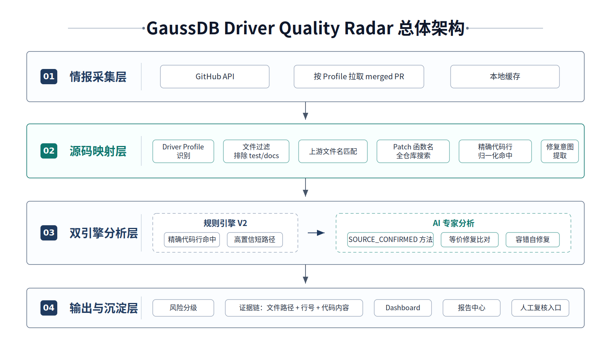

# GaussDB Driver Quality Radar

## 面向数据库驱动的上游缺陷智能感知与同源风险迁移分析平台

> 部门创新评奖申报材料  
> 申报人：jarvis24young（高斯数据库驱动组）  
> 提交日期：2026 年 6 月  
> 建议提交前将「图片占位」替换为系统真实截图

---

## 一、摘要

GaussDB Driver Quality Radar 是一套面向 **高斯数据库驱动质量加固场景** 的 AI 辅助研发平台。项目以上游 PostgreSQL 开源生态（psqlODBC、PGJDBC）中已合入的 Bug Fix PR 为高价值质量情报源，自动完成 **PR 情报采集 → 本地源码映射 → Patch 证据抽取 → 规则引擎确定性预判 → 大模型专家研判 → 证据链生成 → 风险分级 → 台账沉淀** 全流程闭环。

核心价值在于：将上游社区中已被 issue 报告、社区讨论、代码 review 和合入流程层层验证过的缺陷修复经验，转化为 GaussDB 驱动本地代码 **可感知、可复核、可沉淀** 的质量风险排查线索。单 PR 分析可由人工阅读、搜索、比对的分钟级流程，压缩为系统自动初筛和证据定位的秒级到分钟级流程；更重要的是，分析结论以风险台账形式持续沉淀，避免质量排查只停留在个人经验和临时记录中。

项目已具备完整可运行 Demo，覆盖 ODBC/JDBC 双 Profile 支持、单 PR 分析、批量分析、风险筛选、报告中心、浏览器打印/导出 PDF、多 AI 模型适配和 ClaudeCode 配置一键导入，可用于部门版本发布前风险扫描、质量加固专项和创新实践展示。

> **[图片 1：Dashboard 主页真实截图]**  
> *PR 列表、风险等级标签、统计卡片、详情面板一屏全貌*

### 1.1 评审视角价值摘要

| 评审关注点 | 本项目对应价值 |
|---|---|
| 是否来自真实业务痛点 | 来源于 GaussDB ODBC/JDBC 驱动质量排查中真实存在的上游修复同步、同源风险补漏和版本发布前风险扫描问题。 |
| 是否体现 AI 提效 | AI 不只生成代码，而是参与上游缺陷情报理解、本地代码语义比对和风险解释，覆盖研发质量流程中的高重复、高经验依赖环节。 |
| 是否有工程闭环 | 已形成 PR 拉取、Patch 解析、本地匹配、规则预判、AI 研判、证据输出、可视化台账和报告中心的完整链路。 |
| 是否可复核可信 | 每条结论绑定上游 Patch、本地文件、精确行号、命中代码和判断依据，研发人员可直接复核，不依赖模型口头结论。 |
| 是否可推广复用 | 从 ODBC/JDBC 驱动起步，方法可扩展至 libpq、客户端工具、数据库内核、基础软件兼容层和中间件质量治理场景。 |

---

## 二、创意详情

### 2.1 创意来源

GaussDB ODBC / JDBC 驱动与 PostgreSQL 开源生态（psqlODBC、PGJDBC）存在深度技术同源关系——驱动框架、函数名、数据结构、协议处理逻辑高度相似。上游社区中每天都有新的 Bug Fix PR 被合入，这些 PR 背后是一批经过真实用户问题驱动和社区多轮 review 验证的高价值质量情报。

作为驱动组新员工，我在学习 ODBC 驱动代码时发现：**团队排查上游修复是否影响 GaussDB 驱动，高度依赖人工浏览社区、逐 PR 阅读 Patch、手动搜索本地代码、依赖资深工程师经验判断——这一过程耗时、不可持续、且容易遗漏。**

由此产生创意：**能否构建一套自动化管线，将上游已合入 PR 持续转化为本地代码的可复核风险台账？**

### 2.2 创意独特性：四个「不是」

| 表面可能被误解为 | 实际本质 |
|---|---|
| 又一个 AI 聊天问答工具 | 面向数据库驱动质量流程的 **工程化分析平台** |
| 简单的代码关键词搜索脚本 | 覆盖情报采集→源码映射→证据抽取→规则+AI 双引擎研判→台账沉淀的 **完整管线** |
| 一次性 Demo 原型 | 支持多 Profile、批量分析、缓存复用、报告导出、内网多模型适配的 **可持续运行系统** |
| AI 随意输出一段分析文本 | 上游 Patch 证据 + 本地精确行号命中 + 规则引擎 V2 高置信预判 + AI 专家复核的 **证据链体系** |

### 2.3 五个核心创意维度

**创意 1：将 AI 的应用从「生成代码」转向「消化质量情报」**

传统 AI 编程实践聚焦代码生成、补全或单点问答。本项目的差异化在于：不追求「AI 帮你写代码」，而是让 AI **消化上游社区中经过层层验证的缺陷修复经验**，将其转化为面向本地代码的风险推理和修复状态评估。AI 的角色是「情报分析师」而非「代码生成器」。

**创意 2：从「文件名相似」升级到「同源风险迁移分析」**

不是简单判断上游改了哪个文件、本地有没有同名文件，而是综合：上游修复意图提取 → Patch 精确代码行归一化比对 → 本地函数定义级上下文抽取 → 跨文件入口补充匹配 → ODBC/JDBC 领域语义规则 → 判断是否存在同源风险或变体风险。从「表面相似」升级到「缺陷模式等价性判断」。

**创意 3：从「AI 黑盒结论」升级到「可审计证据链输出」**

数据库质量分析不能只输出一句话结论。系统强制每条分析结果包含：上游修复点 → 上游 Patch 证据 → 本地文件路径 → 精确命中行号 + 代码内容 → 风险判断依据 → 修复/测试建议。研发人员可直接定位到 `文件:行号` 进行人工复核，使 AI 输出从「不可解释」变为「可审计」。

**创意 4：「规则先行、AI 兜底」的双引擎设计**

不是所有 PR 都需要调用大模型。系统先通过规则引擎 V2 做确定性预判——当本地精确命中上游新增修复行、且未命中删除旧逻辑时，直接判定「已修复 / 无需处理」，不消耗模型调用。只有在低置信场景才调用大模型。这一设计兼顾了成本、速度和可靠性。

**创意 5：从「个人原型」到「内网可落地平台」的工程化思维**

项目不是「在我电脑上能跑」，而是考虑了华为内网研发环境的真实约束：多 AI 模型适配（Anthropic / DeepSeek / MiniMax）、代理配置、Token 脱敏、ClaudeCode 配置一键导入、批量分析串行队列、失败兜底和结果缓存。具备向团队推广的工程基础。

### 2.4 创新性凝练

本项目的创新性可以概括为“五个转变”：

| 创新维度 | 传统方式 | 本项目创新 |
|---|---|---|
| 数据源 | 依赖人工偶然关注上游 issue、PR、release note | 将上游 merged PR 固化为可持续采集的质量情报源 |
| 分析方法 | 人工搜索文件名、关键词和局部代码片段 | Patch 结构化解析 + 本地源码映射 + 规则引擎 + AI 专家研判 |
| 可信机制 | 依赖个人经验给出结论 | 每条结论绑定上游变更、本地文件、精确行号和代码证据 |
| 组织沉淀 | 排查结果散落在个人笔记或聊天记录 | 风险等级、修复状态、证据链和报告中心形成可复用台账 |
| 推广路径 | 单人临时排查 | 可扩展为版本发布前扫描、质量周检、上游风险持续预警机制 |

这使项目从“AI 辅助写代码”提升为“AI 辅助质量治理”：AI 不直接替代研发判断，而是把高价值社区经验高效搬运到本地代码面前，让工程师把时间集中在复核、决策和修复上。

---

## 三、场景问题

### 3.1 业务场景

GaussDB 数据库驱动（ODBC / JDBC）长期面对兼容性、稳定性、内存安全、协议交互和边界参数处理等质量挑战。驱动代码与 PostgreSQL 开源生态存在深度技术同源——psqlODBC / PGJDBC 上游社区中已合入的 Bug Fix PR，实际上是一批 **经过社区验证的高价值质量情报**。

这些上游 PR 可能修复了以下类型的问题：

- 内存安全：缓冲区溢出（如 `getPrecisionPart()` 栈缓冲区溢出）、空指针解引用、use-after-free
- 协议兼容：前后端协议交互异常、连接参数解析/转义校验缺失
- 资源管理：句柄泄漏、内存泄漏、资源释放顺序错误
- 边界条件：负长度、零长度、超长输入、特殊字符编码边界
- 数据绑定：描述符字段（SQL_DESC_*）精度/标度、SQL_C_BINARY 缓冲区计算
- 状态机：事务状态、游标状态迁移错误

**如果 GaussDB 驱动侧仍保留类似旧逻辑，这些上游已经暴露并修复的缺陷，就可能在客户业务、版本升级或边界场景下被再次触发。**

### 3.2 核心痛点

| 痛点 | 具体表现 | 业务影响 |
|---|---|---|
| **人工追踪成本高** | 需定期浏览社区 PR、逐条阅读描述和 Patch、手动搜索本地代码 | 难以持续执行，容易遗漏关键修复 |
| **源码映射难度大** | 文件名/目录/函数拆分长期演进后与上游不一致，关键词搜索不可靠 | 容易漏判或误判 |
| **专家经验依赖强** | 判断「是否真实风险、是否已内部同步、是否只影响测试」强依赖资深工程师 | 新人/测试人员无法独立判断 |
| **质量线索难以沉淀** | 排查结果散落在笔记、聊天记录、临时文档中 | 无法追溯、无法复用、无法审计 |
| **缺乏管理视图** | 无法量化「排查了多少 PR、发现了多少风险、修复了多少」 | 领导难以评估投入产出 |

### 3.3 问题本质

本项目解决的不是泛化的「如何让 AI 读代码」，而是一个具体的数据库工程质量治理问题：

> **如何将上游开源社区已经验证过的缺陷修复，持续、自动、可复核地转化为 GaussDB 本地驱动代码的质量排查任务？**

### 3.4 数据库驱动场景的特殊难点

数据库驱动质量问题与普通业务代码缺陷不同，具有更强的隐蔽性和更高的复现成本：

| 特殊性 | 说明 |
|---|---|
| API 规范约束强 | ODBC/JDBC API 行为受标准规范、驱动管理器和客户端框架共同约束，同一处参数校验缺失可能影响多个上层调用路径。 |
| 边界输入多 | 长度、编码、NULL 值、描述符字段、二进制数据、游标状态等组合复杂，人工很难穷举。 |
| 缺陷触发条件隐蔽 | 很多问题只有在特定数据库版本、连接参数、字符集、平台或客户端调用顺序下触发。 |
| 本地魔改增加判断难度 | GaussDB 驱动与上游存在同源关系，但不是简单镜像，存在产品增强、接口兼容和历史演进差异。 |
| 质量影响外溢明显 | 驱动位于应用与数据库之间，一旦出现稳定性或兼容性问题，容易被客户感知为数据库整体质量问题。 |

因此，该场景天然适合“上游缺陷情报 + 本地证据链 + AI 辅助研判”的组合方式：上游 PR 提供真实缺陷样本，本地代码匹配提供可验证证据，AI 则帮助补足跨文件语义和专家经验解释。

---

## 四、方案描述

### 4.1 总体架构

系统按四层架构设计，形成从「情报」到「台账」的完整数据流：

```
┌──────────────────────────────────────────────────────┐
│             情报采集层                                 │
│  GitHub API → 按 Profile 拉取 merged PR → 本地缓存     │
└────────────────────┬─────────────────────────────────┘
                     ▼
┌──────────────────────────────────────────────────────┐
│             源码映射层                                 │
│  Driver Profile 识别 · 文件过滤 (排除 test/docs)        │
│  上游文件名匹配 · Patch 函数名全仓库搜索                │
│  精确代码行归一化命中 · 上游修复意图提取                 │
└────────────────────┬─────────────────────────────────┘
                     ▼
┌──────────────────────────────────────────────────────┐
│             双引擎分析层                                │
│  ┌────────────────┐   ┌──────────────────────┐       │
│  │ 规则引擎 V2     │──▶│ AI 专家分析            │       │
│  │ 精确代码行命中   │   │ SOURCE_CONFIRMED 方法  │       │
│  │ 高置信短路径     │   │ 等价修复比对 + 容错自修复│       │
│  └────────────────┘   └──────────────────────┘       │
└────────────────────┬─────────────────────────────────┘
                     ▼
┌──────────────────────────────────────────────────────┐
│             输出与沉淀层                                │
│  风险分级 (高风险/中风险/低风险/已修复无需处理)          │
│  证据链 (文件路径 + 行号 + 代码内容)                    │
│  Dashboard · 报告中心 · 人工复核入口                    │
└──────────────────────────────────────────────────────┘
```

> **[图片 2：总体架构图]**  
> *四层架构分层展示，标注每层核心模块*



### 4.2 核心工作流

| 序号 | 环节 | 关键设计 |
|---|---|---|
| ① | PR 情报拉取 | 从 GitHub API 拉取 closed & merged PR，按页分批，本地文件缓存 |
| ② | 文件过滤 | 按 Profile 过滤产品源码（ODBC: `.c/.h`，JDBC: `.java/.kt`），排除 test/docs/example |
| ③ | Patch 证据抽取 | 解析 hunk header、函数名、标识符、新增行、删除行 |
| ④ | 本地文件匹配 | 按上游文件名/路径 + 函数名全仓库搜索，支持多层级目录 |
| ⑤ | 精确代码行命中 | 归一化比对（去注释、去空白），判断本地是否已含新增修复行/仍保留删除旧逻辑 |
| ⑥ | 上游意图提取 | 从 PR 标题、描述、变更文件、测试文件名合成上游修复语义摘要 |
| ⑦ | 规则引擎 V2 预判 | 基于精确命中信号输出修复状态、风险等级和规则置信度 |
| ⑧ | AI 专家研判 | 高置信短路径直接返回；低置信调用大模型按 SOURCE_CONFIRMED_DRIVER_SYNC 方法分析 |
| ⑨ | 证据链生成 | 结构化输出含文件路径、精确行号、代码内容、风险依据 |
| ⑩ | 台账沉淀 | 写入缓存，按 Prompt 版本管理，支持 Dashboard 可视化和报告中心导出 |

### 4.3 关键技术细节

**（一）精确代码行归一化比对**

不是简单的 `grep` 关键词匹配。系统将 Patch 中每一行新增/删除代码做归一化（去除注释、空白符归一化），然后与本地文件逐行归一化结果做精确比对。只有语义等价的代码行才算命中。出现 `exactAddedMatches` 表示本地已有上游修复，出现 `exactRemovedMatches` 表示本地仍保留旧逻辑。

**（二）函数定义级上下文抽取**

不同于截取文件前 N 行，系统查找 patch 中涉及的函数定义起始位置（函数签名 + `{`），计算到函数结束的完整范围，抽取含行号标注的完整函数上下文。AI 看到的是「相关函数全貌」而非「文件碎片」。

**（三）规则引擎 V2 高置信短路径**

当本地精确命中上游新增修复行（`exactAddedMatches`）且未命中删除旧逻辑时 → 直接判定 **已修复 / 无需处理**，不调用 AI。当本地精确命中上游删除旧逻辑（`exactRemovedMatches`）且未命中新增修复时 → 直接判定 **需同步修复**。仅当规则置信度较低、存在变体实现或上下文不完整时，才调用大模型做函数级专家分析。

**（四）ODBC 描述符语义发现**

针对 ODBC 特殊场景（SQLSetDescRec / SQLGetDescRec 等），系统自动检测本地入口函数是否为 `return SQL_ERROR` 的占位实现。若是，即使函数存在，也不将上游修复误判为「已同步」——这是通用 AI 模型容易忽略的领域特化边界。

**（五）AI 输出三层容错**

① 多层 JSON 解析（去除 `<think>` 文本 → 提取 markdown 代码块 → 平衡括号截取 → 全角半角字符修复）  
② 解析失败时发起第二次 AI 调用（JSON Repair Prompt），让模型自行修复格式  
③ 两次均失败时回退到规则引擎结论，确保不丢分析结果

### 4.4 支持的驱动 Profile

| Profile | 上游仓库 | 本地分析对象 | 文件类型 | 当前状态 |
|---|---|---|---|---|
| ODBC | `postgresql-interfaces/psqlodbc` | GaussDB ODBC | `.c` `.h` | 已落地运行 |
| JDBC | `pgjdbc/pgjdbc` | GaussDB JDBC | `.java` `.kt` | 已支持 |

### 4.5 技术难点与解决方式

| 技术难点 | 为什么难 | 本项目解决方式 |
|---|---|---|
| 上游与本地代码不是完全同构 | GaussDB 驱动经过长期演进后，文件目录、函数拆分、宏定义和局部实现可能与上游不同 | 文件名匹配 + 函数名抽取 + 全仓库补充搜索 + 精确代码行归一化命中，降低单一关键词搜索的漏判风险 |
| PR 变更中混有测试和文档 | 上游 PR 常同时修改测试、文档、样例，直接分析会制造噪声 | 按 Profile 过滤产品源码类型，排除 test/docs/example 等非产品路径，保留对风险判断真正有价值的代码变更 |
| AI 容易给出不可复核结论 | 大模型可能直接判断“有风险”或“无风险”，但缺少可审计依据 | 强制输出本地文件、行号、代码内容、风险原因和修复建议，让研发人员能按证据复核 |
| 模型输出格式不稳定 | 推理模型可能夹带思考文本或返回非 JSON 内容，影响自动化流程 | 规则层优先、JSON 多层解析、格式修复提示、失败时规则兜底，保证页面能给出可用结果 |
| 数据库驱动存在领域语义 | ODBC/JDBC API 行为受规范约束，函数存在不代表功能实现完整 | 增加 ODBC 描述符、参数长度、数据绑定等领域规则，识别通用模型不容易发现的占位实现和边界风险 |

### 4.6 可信 AI 设计原则

为了避免“AI 看起来很会说，但结论不可用”的问题，本项目在设计上遵循四个原则：

| 原则 | 落地方式 |
|---|---|
| Source-confirmed | AI 只能基于上游 Patch、本地源码片段、规则命中证据进行判断，不鼓励脱离源码自由推断。 |
| Rule-first | 高确定性场景优先由规则引擎判断，降低模型不稳定性和调用成本。 |
| Evidence-first | 输出必须包含本地文件、行号、代码内容和风险理由，便于研发人员复核。 |
| Human-in-the-loop | AI 输出作为初筛和解释，不直接替代研发修复决策；结论可进入后续人工复核和缺陷闭环。 |

这套设计使项目更接近“可信研发助手”，而不是一次性 AI 问答 Demo。

> **[图片 3：规则引擎 + AI 双引擎决策流程图]**  
> *展示高置信短路径、语义发现、AI 兜底三层决策逻辑*

---

## 五、应用效果

### 5.1 效率提升

当前建议采用“真实试运行数据 + 谨慎收益描述”的方式表达。效率提升不建议只写一个拍脑袋倍数，而是同时展示系统已经能处理的上游 PR 规模、已沉淀分析结果和可复核证据数量。

| 指标 | 传统人工耗时 | 本平台耗时 | 提升效果 |
|---|---:|---:|---|
| 单 PR 初筛 | 约 3-8 分钟 | 规则命中约 5-15 秒；含 AI 分析约 30-90 秒 | 初筛效率约提升 3-10 倍 |
| 单 PR 本地代码定位 | 约 2-5 分钟 | 约 5-20 秒生成命中文件、行号和证据 | 从手动搜索变为自动定位 |
| 批量分析 100 个 PR | 约 6-16 人时 | 约 30-90 分钟后台批量完成初筛 | 从不可持续人工排查变为可周期执行 |
| 重复分析同一 PR | 约 3-8 分钟 | 缓存命中约 1 秒内返回 | 基本消除重复排查成本 |
| 结果复核准备 | 需人工整理截图、路径和说明，约 2-5 分钟 | 自动输出文件路径、行号、代码证据和风险理由 | 复核材料自动沉淀 |

> 说明：上表为当前 Demo 试运行和典型人工流程下的估算值，正式推广时可通过试点日志统计平均分析耗时、P95 分析耗时和人工复核耗时，形成更严格的量化收益。

当前 ODBC Profile 本地试运行快照如下：

| 试运行指标 | 当前结果 | 说明 |
|---|---:|---|
| 上游 merged PR 缓存数 | 104 | 来自 psqlODBC 上游仓库缓存 |
| 已沉淀结构化分析结果 | 14 | 已生成风险等级、修复状态、证据链和建议 |
| 当前扫描覆盖率 | 13.5% | 14 / 104，后续可通过批量分析继续提升 |
| 命中本地源码文件数 | 15 | 去重后的本地 GaussDB ODBC 命中文件 |
| 系统标记高风险线索 | 7 | 需人工复核，不等同于最终确认缺陷 |
| 系统标记中风险线索 | 4 | 可纳入质量专项继续确认 |
| 已修复 / 无需处理 | 2 | 本地已命中上游新增修复证据 |
| 证据不足 / 需复核 | 1 | 工具保留人工判断入口，避免过度断言 |

> 说明：以上数据来自当前本地 Demo 缓存，适合作为“试运行能力证明”。正式汇报时建议继续补充人工复核后的确认风险数、已提单数、已修复数和回归测试数，形成更完整的质量闭环数据。

### 5.2 风险前移

通过持续跟踪上游已修复问题，帮助团队在客户现场暴露前提前识别内部同源风险或变体风险，将质量治理从被动响应推进到主动预警。

### 5.3 能力输出

| 能力 | 状态 | 说明 |
|---|---|---|
| ODBC / JDBC 双 Profile | 已完成 | 数据隔离存储，独立分析 |
| PR 拉取与缓存 | 已完成 | 按页分批，本地 JSON 缓存 |
| Patch 证据抽取 | 已完成 | 函数名、标识符、代码行、hunk header |
| 本地文件/函数级匹配 | 已完成 | 文件名匹配 + 全仓库函数搜索 |
| 精确代码行归一化命中 | 已完成 | 去注释 + 空白归一化后逐行比对 |
| 规则引擎 V2 确定性预判 | 已完成 | 规则置信度、修复状态和风险等级联合判断 |
| 高置信短路径（零 AI 成本） | 已完成 | 规则直接返回确定性结论 |
| ODBC 描述符语义发现 | 已完成 | 检测未实现占位函数 |
| 上游修复意图提取 | 已完成 | PR 标题 + 描述 + 变更文件语义合成 |
| AI 专家分析（SOURCE_CONFIRMED 方法） | 已完成 | 驱动专家视角等价修复比对 |
| AI 输出容错 + 自修复 + 规则兜底 | 已完成 | 三层 JSON 解析容错 |
| 单 PR 分析 + 批量分析 + 队列管理 | 已完成 | 逐队执行，避免接口限流 |
| 多 AI 模型适配 | 已完成 | Anthropic / DeepSeek / MiniMax |
| ClaudeCode 配置一键导入 | 已完成 | 扫描 5 个常见配置位置 |
| 风险等级可视化 + 详情面板 | 已完成 | 高风险 / 中风险 / 低风险 / 已修复状态标注 |
| 报告中心 | 已完成 | 风险分布 + 文件命中矩阵 + 高风险清单 |
| Token 脱敏 / 代理配置 / 本地部署 | 已完成 | 内网安全适配 |

### 5.4 典型演示样例

| 演示样例 | 展示重点 | 评审可感知价值 |
|---|---|---|
| 上游修复已在本地存在 | 展示“已修复 / 无需处理”，本地精确命中上游新增修复代码 | 证明工具不会只制造风险，也能识别无需重复开发的场景 |
| 上游修复涉及内存安全或参数校验 | 展示 HIGH 风险、本地命中文件、旧逻辑证据和修复建议 | 证明工具能帮助质量专项提前发现高价值风险线索 |
| 上游 PR 与本地实现存在差异 | 展示“证据不足 / 需复核”及本地上下文 | 证明工具在证据不足时不会过度断言，保留人工判断入口 |
| 报告中心汇总 | 展示风险分布、文件命中矩阵、高风险清单和行动建议 | 证明工具不只是单点分析，而是具备管理视图和汇报价值 |

### 5.5 后续试点评价指标

正式推广前，建议用以下指标衡量试点效果，避免只停留在主观体验：

| 指标 | 说明 |
|---|---|
| 上游 PR 覆盖数 | 指定周期内拉取并进入分析台账的 merged PR 数量。 |
| 产品代码命中率 | 上游 PR 中实际命中本地 ODBC/JDBC 产品代码的比例。 |
| 高风险确认率 | 工具输出 HIGH/MEDIUM 后，经人工复核确认为真实风险或需进一步排查的比例。 |
| 已修复识别准确性 | 工具判断“已修复 / 无需处理”的样例，经人工复核后是否确实不需要同步修复。 |
| 平均初筛耗时 | 从点击分析到输出结构化证据链的平均耗时。 |
| 复核闭环率 | 已进入台账的风险项中，完成确认、排除、修复或提单的比例。 |

这些指标可以支撑后续从“创新 Demo”升级为“质量专项工具”的量化汇报。

> **[图片 4：Dashboard 分析结果真实截图]**  
> *风险等级标签 + 详情面板证据链 + 命中文件列表一屏展示*

> **[图片 5：报告中心真实截图]**  
> *风险热力图、文件命中矩阵、高风险项清单*

---

## 六、推广价值

### 6.1 可复用场景

| 场景 | 应用方式 | 受益角色 |
|---|---|---|
| 版本发布前风险扫描 | GA 发布前自动扫描近期上游 merged PR | 版本经理、QA |
| 驱动质量加固专项 | 批量分析历史 PR，生成高风险排查清单 | 开发、测试 |
| 开源修复同步 | 跟踪上游修复，判断是否需要等价 cherry-pick | 模块责任人 |
| 历史缺陷补漏 | 针对长期未关注的上游修复批量生成台账 | 质量工程师 |
| 新人辅助分析 | 帮助不熟悉驱动代码的新员工快速理解 PR 影响 | 新员工 |
| 测试用例设计 | 基于上游缺陷模式生成边界测试场景和断言点 | 测试工程师 |

### 6.2 可扩展路线

```
已完成：ODBC 场景深度打磨（规则引擎 V2 + 语义发现 + 报告中心）
   ↓
近期：JDBC 场景拓展（Java 方法级匹配 + PreparedStatement/ResultSet 路径分析）
   ↓
中期：测试闭环 + 质量知识库沉淀（缺陷模式库 → 自动生成测试用例）
   ↓
长期：持续预警平台（定时扫描 → 自动周报 → 与缺陷管理系统集成）
   ↓
远期：更多信号源（PostgreSQL 邮件列表补丁、CVE/安全公告、数据库内核场景）
```

### 6.3 团队推广基础

项目已考虑华为内网研发环境约束，具备团队推广条件：

- 支持内网 AI 网关 Base URL + Token + Proxy 配置
- ClaudeCode 配置一键导入，降低迁移门槛
- Token 全链路脱敏展示
- 本地轻量部署，便于在内外网环境迁移
- 无需外部服务依赖，`npm install && npm start` 即可运行

### 6.4 从工具到机制的推广路径

| 阶段 | 推广动作 | 形成机制 |
|---|---|---|
| 个人试点 | 驱动责任人定期扫描 ODBC/JDBC 上游 merged PR | 个人质量排查助手 |
| 小组试点 | 每周批量分析新增 PR，形成高风险项清单 | 驱动质量周检机制 |
| 版本专项 | GA 前扫描最近周期上游修复，输出发布前风险报告 | 版本发布前质量门禁补充 |
| 知识沉淀 | 对确认风险沉淀缺陷模式、修复模式和测试建议 | 驱动质量知识库 |
| 平台化 | 接入内部缺陷系统、代码评审和定时任务 | 持续上游风险预警平台 |

> **[图片 6：配置导入页面真实截图]**  
> *Profile 选择、本地路径、AI 模型配置、ClaudeCode 一键导入*

> **[图片 7：演进路线时间轴图]**  
> *六阶段演进路线，标注当前已完成项*

---

## 七、项目总结

> **GaussDB Driver Quality Radar** 将上游 PostgreSQL 开源生态的缺陷修复 PR，转化为 GaussDB 驱动侧 **可感知、可复核、可沉淀** 的质量风险情报。它不是用 AI 替代研发判断，而是用 AI 把社区经验高效搬运到本地代码面前——让工程师少搜索、多判断，形成面向数据库驱动质量加固的 **AI 主动预警闭环**。

---

## 八、答辩口径

### 8.1 30 秒版本

GaussDB Driver Quality Radar 面向数据库驱动质量加固，将 psqlODBC、PGJDBC 等上游社区已经合入的缺陷修复 PR，自动转化为 GaussDB ODBC/JDBC 本地源码风险排查线索。工具可以拉取 PR、解析 Patch、匹配本地代码，结合规则引擎和大模型输出风险等级、修复状态、证据链和修复建议，并沉淀为可视化风险台账。它的价值是把人工经验排查升级为 AI 主动风险感知。

### 8.2 1 分钟版本

GaussDB 驱动与 PostgreSQL 开源生态存在同源关系，上游已经修复过的问题，对内部质量排查有很高参考价值。过去这类工作依赖人工跟踪 PR、阅读 Patch、搜索本地代码和专家判断，效率低且难以沉淀。本项目把这条链路做成平台：先通过 GitHub API 拉取上游 merged PR，再解析 Patch 中的新增/删除代码、函数名和标识符，映射到本地 GaussDB ODBC/JDBC 源码；规则引擎先做确定性判断，复杂场景再由大模型按数据库驱动专家视角分析。最终输出不是简单摘要，而是可复核的本地文件、行号、证据、风险原因和修复建议。

### 8.3 被问到“创新性在哪里”时

重点回答三点：

1. 不是让 AI 生成代码，而是让 AI 消化上游社区质量情报，把开源生态修复经验转化为内部质量风险线索。
2. 不是 AI 黑盒判断，而是规则引擎、Patch 证据、本地源码行号和 AI 专家解释结合，保证结论可复核。
3. 不是一次性 Demo，而是已经考虑 ODBC/JDBC Profile、内网模型、代理、Token 脱敏、批量分析、报告中心和人工复核入口，具备推广基础。

### 8.4 被问到“准确率如何保证”时

准确率不依赖单次模型自由发挥，而是通过四层机制控制：第一层过滤测试和文档变更，减少噪声；第二层做新增/删除代码行归一化精确匹配；第三层用规则引擎处理已修复、需同步、证据不足等高确定性场景；第四层才调用大模型做复杂语义判断。最终所有结论都带本地代码证据，必须经过研发人员复核后进入修复流程。

### 8.5 被问到“和传统代码扫描工具有什么区别”时

传统代码扫描工具主要从本地代码出发，按照内置规则发现通用缺陷模式；本项目从上游社区已修复 PR 出发，把真实发生过、已经被社区验证的缺陷修复作为质量情报，再分析本地是否存在同源或变体风险。它不是替代 SAST，而是补充一种“基于上游演进信号的风险发现方式”，更适合开源同源数据库产品的质量补漏场景。

### 8.6 被问到“下一步如何真正落地”时

下一步建议按三步推进：第一步在 ODBC/JDBC 质量专项中试点，固定每周扫描新增上游 merged PR；第二步增加人工复核状态和缺陷单关联，形成“发现—确认—修复—回归”的闭环；第三步沉淀缺陷模式库和测试建议库，把单次 PR 分析结果转化为长期可复用的驱动质量知识资产。

---

## 九、配图清单

| 编号 | 位置 | 内容 | 来源 |
|---|---|---|---|
| 图片 1 | 摘要之后 | Dashboard 主页（PR 列表 + 风险标签 + 统计卡片 + 详情面板） | **真实截图** |
| 图片 2 | 方案描述 · 总体架构 | 四层架构图（情报→映射→分析→输出） | AI 生成或 Draw.io 手绘 |
| 图片 3 | 方案描述 · 技术细节 | 规则引擎 + AI 双引擎决策流程图 | Draw.io / Excalidraw |
| 图片 4 | 应用效果 | 分析结果详情面板（风险等级 + 证据链 + 命中文件） | **真实截图** |
| 图片 5 | 应用效果 | 报告中心页面（风险热力图 + 文件命中矩阵 + 高风险清单） | **真实截图** |
| 图片 6 | 推广价值 | 配置页面（Profile 选择 + ClaudeCode 导入） | **真实截图** |
| 图片 7 | 推广价值 · 扩展路线 | 六阶段演进路线时间轴 | AI 生成或手绘 |

> **提交建议**：
> 1. 图片 1、4、5、6 必须使用真实系统截图——这是「已经做出来」的核心证据
> 2. 架构图和流程图推荐用 Draw.io 或 Excalidraw 手绘，比 AI 生成图更有工程感和可信度
> 3. 答辩时建议现场打开系统演示（预拉 PR 列表 + 现场分析 1-2 个 PR），冲击力远超截图
> 4. 如有试点数据（分析了多少个 PR、发现多少个 HIGH/MEDIUM 风险），务必填入第五节
